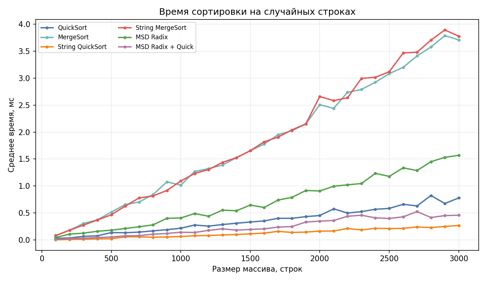
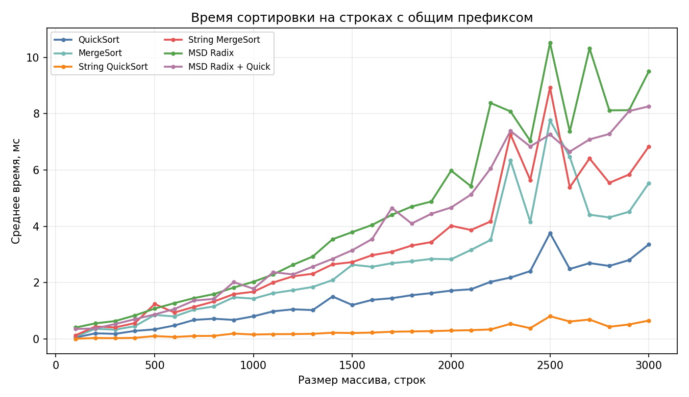
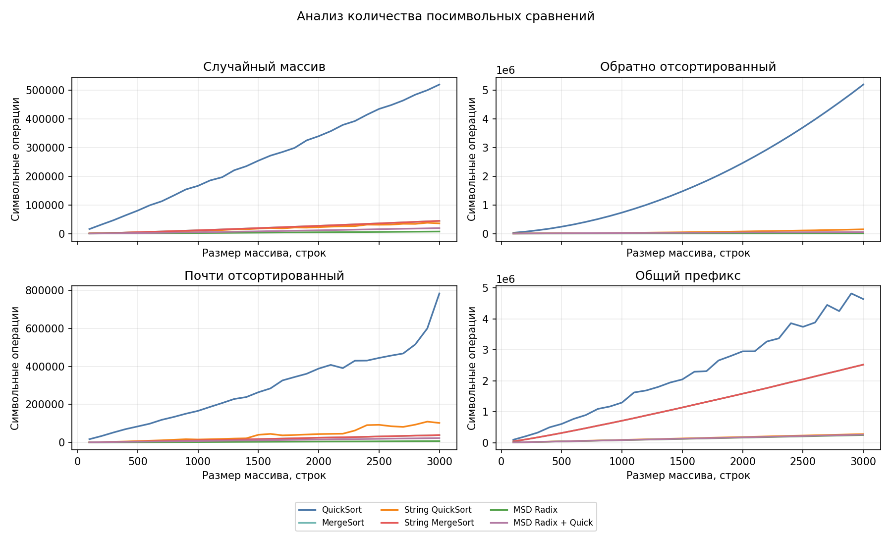
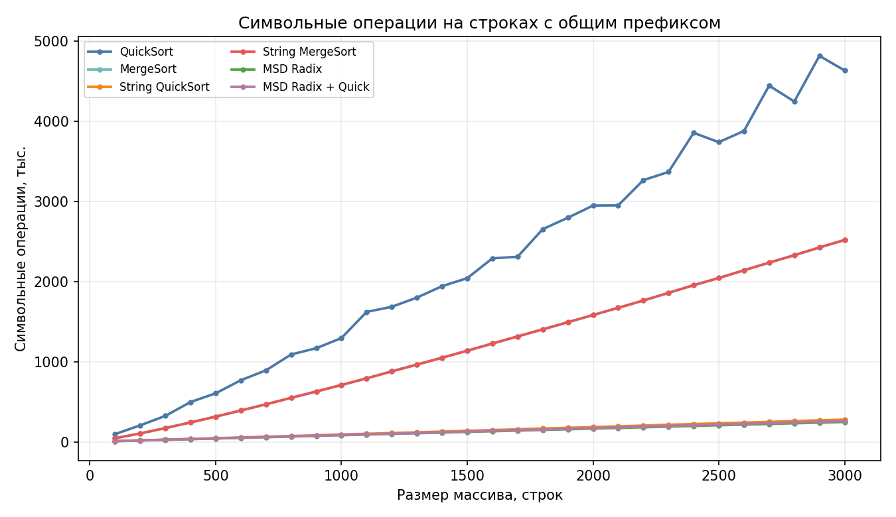

# SET 9 A1

# A1. Анализ строковых сортировок

Путинцева Вера, БПИ247

## Посылки 

- `A1m`: 375669344
- `A1q`: 375669566
- `A1r`: 375855198
- `A1rq`: 375855269

## Структура

- `src/string_sorts.hpp` - реализации алгоритмов и класс `StringGenerator`
- `src/benchmark.cpp` - класс `StringSortTester` и запуск эксперимента
- `data/raw_results.csv` - результаты замеров
- `analysis/plot_results.py` - построение графиков и таблиц
- `analysis/figures/` - итоговые графики

## Данные

Алфавит: `A..Z`, `a..z`, `0..9`, `!@#%:;^&*()-`, всего 74 символа. Длины строк: от 10 до 200. Размеры массивов: от 100 до 3000 с шагом 100.

Типы массивов:

- `random`: случайный массив.
- `reversed`: строки в обратном лексикографическом порядке.
- `almost_sorted`: отсортированный массив с небольшим числом случайных перестановок.
- `common_prefix`: строки с общим префиксом длины 80.

Для каждого типа сначала создавался массив размера 3000, затем из него брались префиксы нужной длины. Каждый замер повторялся 7 раз, в таблицах и графиках используется среднее время.

Сравнивались:

- обычные `QuickSort` и `MergeSort`;
- тернарный `String QuickSort`;
- `String MergeSort`;
- `MSD Radix Sort`;
- `MSD Radix Sort` с переключением на `String QuickSort`, если размер подмассива меньше 74.

## Графики

### Время на случайных строках

### Время на строках с общим префиксом

### Анализ количества посимвольных сравнений

### Символьные операции на строках с общим префиксом

## Анализ графиков

### Случайная выборка

На графике [time_random.png](analysis/figures/time_random.png) быстрее всех идет `String QuickSort`. При `n = 3000` он занимает примерно `0.3 мс` и делает около `36 тыс.` символьных операций.

При `n = 3000`:

- `String QuickSort`: около `0.3 мс`, лучший результат
- `MSD Radix + Quick`: около `0.5 мс`, примерно в `1.7` раза медленнее
- `QuickSort`: около `0.8 мс`, примерно в `3` раза медленнее и около `520 тыс.` символьных сравнений
- `MSD Radix`: около `1.6 мс`, хотя символьных операций меньше всего, примерно `7 тыс.`
- `MergeSort` и `String MergeSort`: около `3.7-3.8 мс`, то есть примерно в `14` раз медленнее лидера

От `n = 100` до `n = 3000` время `String QuickSort` выросло примерно в `80` раз, `MSD Radix + Quick` - примерно в `50` раз, `QuickSort` - примерно в `30` раз, НО несмотря на больший коэффициент роста, `String QuickSort` остается быстрее из-за маленькой константы и меньшего числа лишних сравнений символов

### Строки с общим префиксом

[time_prefix.png](analysis/figures/time_prefix.png) - все строки имеют общий префикс длины 80. Обычные сравнения строк становятся дорогими, потому что один и тот же общий префикс просматривается много раз

При `n = 3000`:

- `String QuickSort`: около `0.7 мс`, лучший результат
- `QuickSort`: около `3.4 мс`, примерно в `5` раз медленнее
- `MergeSort`: около `5.5 мс`, примерно в `8` раз медленнее
- `String MergeSort`: около `6.8 мс`, примерно в `10` раз медленнее
- `MSD Radix + Quick`: около `8.3 мс`, примерно в `13` раз медленнее
- `MSD Radix`: около `9.5 мс`, примерно в `15` раз медленнее

На графике [char_prefix.png](analysis/figures/char_prefix.png) видно почему обычные сортировки проигрывают: `QuickSort` делает около `4.6 млн` символьных сравнений, `MergeSort` и `String MergeSort` - примерно по `2.5 млн`. У `String QuickSort` около `280 тыс.` символьных операций, то есть примерно в `17` раз меньше, чем у `QuickSort`

чистый `MSD Radix` снизился примерно с `34 мс` до `~9.5 мс`, гибрид примерно с `31 мс` до `~8.3 мс`. Но `String QuickSort` все равно лучше, потому что radix долго проходит общий префикс по уровням, пока строки почти не разделяются

### Почти отсортированная выборка

На почти отсортированной выборке лучший результат показал `MSD Radix + Quick`

При `n = 3000`:

- `MSD Radix + Quick`: около `0.4 мс`, лучший результат
- `String QuickSort`: около `0.6 мс`, примерно в `1.5` раза медленнее
- `QuickSort`: около `0.8 мс`, примерно в `2` раза медленнее
- `MSD Radix`: около `1.2 мс`
- `MergeSort` и `String MergeSort`: около `3.4-3.6 мс`

По символьным операциям чистый `MSD Radix` остается лучшим, около `7 тыс.` операций, но гибрид выигрывает по времени: он не продолжает radix-разбиение на маленьких подмассивах, а досортировывает их `String QuickSort`. У `QuickSort` на этой выборке около `780 тыс.` символьных сравнений, у `String QuickSort` около `100 тыс.`, у гибрида около `23 тыс.`

### Обратно отсортированная выборка

На `reversed` быстрее всех тоже `MSD Radix + Quick`: около `0.5 мс`, далее `String QuickSort` около `0.6 мс`, то есть примерно в `1.3` раза медленнее, ну и обычный `QuickSort` здесь худший- около `6 мс`, примерно в `12` раз медленнее лидера

По графику [char.png](analysis/figures/char.png) видно, что `QuickSort` на обратной выборке делает максимум символьных сравнений среди всех случаев: около `5.2 млн`. Думаю это связано с моей реализацией `QuickSort`, где опорный элемент берется из начала подмассива, на обратном порядке разбиения получаются неудачными

От `n = 100` до `n = 3000` время `QuickSort` выросло примерно в `220-230` раз, а у `MSD Radix + Quick` - примерно в `30` раз. Поэтому к концу графика `QuickSort` уходит далеко выше остальных

### Количество символьных операций

График [char.png](analysis/figures/char.png) объясняет разницу во времени:

- `QuickSort` сильнее всего зависит от порядка и префиксов: примерно `520 тыс.` операций на `random`, `780 тыс.` на `almost_sorted`, `4.6 млн` на `common_prefix`, `5.2 млн` на `reversed`
- `MergeSort` стабильнее по форме роста, но на `common_prefix` тоже резко проседает: примерно `2.5 млн` операций против `45 тыс.` на `random`
- `String QuickSort` заметно лучше обычных сравнительных сортировок: примерно `36 тыс.` операций на `random`, `100 тыс.` на `almost_sorted`, `150 тыс.` на `reversed`, `280 тыс.` на `common_prefix`
- `MSD Radix` почти всегда минимален по символьным операциям: около `7 тыс.` на `random`, `almost_sorted`, `reversed`, около `250 тыс.` на `common_prefix`
- `MSD Radix + Quick` делает больше символьных операций, чем чистый `MSD Radix`, но часто быстрее по времени за счет переключения на `String QuickSort` на маленьких подмассивах

## Сводка при n = 3000

| Тип данных | Алгоритм | Время, мс | Символьные операции |
|---|---:|---:|---:|
| almost_sorted | QuickSort | 0.784 | 783808 |
| almost_sorted | MergeSort | 3.368 | 39044 |
| almost_sorted | String QuickSort | 0.565 | 102678 |
| almost_sorted | String MergeSort | 3.566 | 39044 |
| almost_sorted | MSD Radix | 1.164 | 7227 |
| almost_sorted | MSD Radix + Quick | 0.370 | 23379 |
| common_prefix | QuickSort | 3.360 | 4636778 |
| common_prefix | MergeSort | 5.537 | 2520233 |
| common_prefix | String QuickSort | 0.656 | 276865 |
| common_prefix | String MergeSort | 6.838 | 2520233 |
| common_prefix | MSD Radix | 9.508 | 247305 |
| common_prefix | MSD Radix + Quick | 8.262 | 259458 |
| random | QuickSort | 0.778 | 519846 |
| random | MergeSort | 3.708 | 44457 |
| random | String QuickSort | 0.268 | 35740 |
| random | String MergeSort | 3.776 | 44457 |
| random | MSD Radix | 1.568 | 7227 |
| random | MSD Radix + Quick | 0.458 | 19220 |
| reversed | QuickSort | 5.999 | 5190413 |
| reversed | MergeSort | 3.309 | 28249 |
| reversed | String QuickSort | 0.624 | 148483 |
| reversed | String MergeSort | 3.371 | 28249 |
| reversed | MSD Radix | 1.341 | 7227 |
| reversed | MSD Radix + Quick | 0.483 | 54264 |

## Выводы

### Количество символьных операций

`MSD Radix Sort` принципиально отличается от остальных алгоритмов: он не сравнивает строки попарно, а распределяет их по символам на текущей позиции. Поэтому по числу символьных операций он почти всегда лучший: на `random`, `almost_sorted` и `reversed` получается около `7 тыс.` обращений к символам. На `common_prefix` операций больше, около `250 тыс.`, т.к алгоритм проходит длинный общий префикс по уровням

Добавление переключения на `String QuickSort` увеличивает число символьных операций, например, на `random` у гибрида около `19 тыс.` операций против `7 тыс.` у чистого `MSD Radix`,но по времени гибрид часто лучше, потому что не продолжает создавать уровни radix-сортировки на маленьких подмассивах

Обычный `QuickSort` делает много посимвольных сравнений, потому что каждое сравнение строк может снова просматривать одни и те же символы, особенно это видно на `common_prefix` и `reversed`(примерно `4.6 млн` и `5.2 млн` сравнений), ну и на `reversed` он проседает еще и из-за простого выбора опорного элемента из начала подмассива

`String QuickSort` показывает более разумное число операций: около `36 тыс.` на `random`, `100 тыс.` на `almost_sorted`, `150 тыс.` на `reversed`, `280 тыс.` на `common_prefix`. Он тоже рекурсивный, но работает по текущей позиции символа и не тратит столько времени на повторное сравнение уже обработанных префиксов

`MergeSort` и `String MergeSort` по числу сравнений выглядят стабильнее, чем обычный `QuickSort`, но на строках с общим префиксом тоже резко растут: примерно до `2.5 млн` операций. При слиянии все равно приходится сравнивать строки, а длинный общий префикс делает каждое такое сравнение дорогим

### Время выполнения

На случайной выборке быстрее всех оказался `String QuickSort`: примерно `0.3 мс`. Следом идет `MSD Radix + Quick`, около `0.5 мс`. Чистый `MSD Radix` делает меньше всего символьных операций, но по времени хуже, около `1.6 мс`, потому что у него больше технических действий с распределением строк

На почти отсортированной выборке лучший результат у `MSD Radix + Quick`: примерно `0.4 мс`, гибрид выгодно сочетает radix-разбиение на крупных частях и `String QuickSort` на маленьких подмассивах

На обратно отсортированной выборке снова выигрывает `MSD Radix + Quick`, около `0.5 мс`. Обычный `QuickSort` худший: около `6 мс`

На строках с длинным общим префиксом лучше всех работает `String QuickSort`, около `0.7 мс`. `MSD Radix` и `MSD Radix + Quick` здесь проигрывают по времени, потому что долго проходят общий префикс по уровням, пока строки почти не разделяются.

### Общий итог

Если смотреть только на количество символьных операций, самым сильным выглядит `MSD Radix Sort`

По времени лучшего алгоритма для всех случаев нет, наиболее удачно выглядят `String QuickSort` и `MSD Radix + Quick`: `String QuickSort` лучше переносит длинные общие префиксы и случайные строки, а `MSD Radix + Quick` быстрее на почти отсортированных и обратно отсортированных данных
